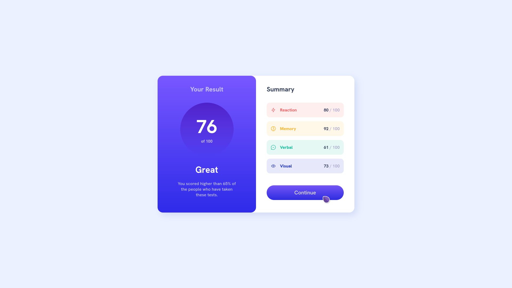

# Frontend Mentor - Results summary component solution

This is a solution to the [Results summary component challenge on Frontend Mentor](https://www.frontendmentor.io/challenges/results-summary-component-CE_K6s0maV). Frontend Mentor challenges help you improve your coding skills by building realistic projects. 

## Table of contents

- [Overview](#overview)
  - [The challenge](#the-challenge)
  - [Screenshot](#screenshot)
  - [Links](#links)
- [My process](#my-process)
  - [Built with](#built-with)
  - [What I learned](#what-i-learned)
  - [Continued development](#continued-development)
  - [Useful resources](#useful-resources)
  - [AI Collaboration](#ai-collaboration)
- [Author](#author)
- [Acknowledgments](#acknowledgments)

## Overview

### The challenge

Users should be able to:

- View the optimal layout for the interface depending on their device's screen size
- See hover and focus states for all interactive elements on the page
- **Bonus**: Use the local JSON data to dynamically populate the content

### Screenshot



### Links

- Solution URL: [View my solution here!!](https://github.com/AgentSquareOfficial/results-summary-component-main.git)
- Live Site URL: [See the site here!!](https://agentsquareofficial.github.io/results-summary-component-main)

## My process

### Built with

- Semantic HTML5 markup
- CSS custom properties
- Flexbox

### What I learned

This time, the project was challenging a bit. The alignment I had done here is very nasty looking. Somehow I had managed to create the proper alignement, what it seemed good. This time I learned a very important thing, I have to get used to some common code sniffets for quick alignments next time onwards. Again, I got removed some dust of the flexbox concepts I had known earlier.

Also this time around, I got idea about different colour channels. They helped me build the colors very close to the original one. One very important thing I want to highlight is that I need to learn more about the mobile version (@media usage). I have'nt done that version yet but will so soon and update it here.

```html
<h1>Some HTML code I'm proud of(The idea of using box2 inside box one. Took me a while to figure it out!!)</h1>
<div class="container">
  <div class="card">
    <div class="box1">
      <div class="box2">
```
```css
.proud-of-this-css {
  justify-content: space-between;(as I dont use this property in regular basis.)
}
```
### Continued development

I want to focus on using the @media part, and using the json for dynamic population. This one took me around 4hrs to complete, so I will try to be little faster on this type of projects in the near future.

### Useful resources

- [Kevin powell](https://www.youtube.com/@KevinPowell) - This man knows his job well. I tried some of his techniques and man it was way optimized and intuitive. 

### AI Collaboration

I had used ChatGPT for alignment part, but the solution it provided did'nt work. So I figured it out on my own(that box1,box2 part!!). 

## Author

- Frontend Mentor - [@agetsquareofficial](https://www.frontendmentor.io/profile/agentsquareofficial)

## Acknowledgments

Somebody commented on my previous solution, some small but general ideas for better code writing. Thanks to that person if you are reading this. Any feedback will be highly appreciated. Thanks very much!!